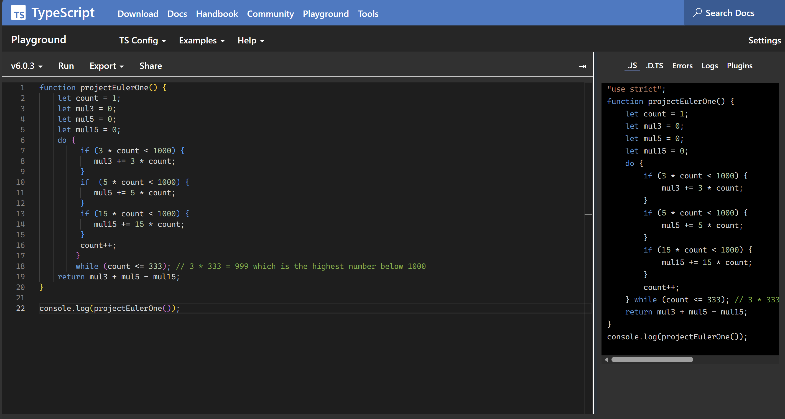

As an electrical engineering student, my coursework has taken me through several programming languages, mostly Python and C/C++.When I started ICS 314, I expected to be using a difficult language like Java. I'd used Java back in ICS 111 during my first year of community college, and it had been a hard language for me at the time so I was a little nervous about facing it again. As it turned out, we were learning something new instead: TypeScript.

Before getting to TypeScript, we had to cover the basics of JavaScript. I was already somewhat familiar with it, having learned a bit about seven years ago in high school, though I hadn't touched it since. Coming back to it, both JavaScript and TypeScript were surprisingly approachable. The syntax felt straightforward, and I was able to get comfortable with things like functions and template literals faster than I expected. It was a nice contrast to the steep learning curve I remembered from Java.

As for the athletic software engineering style, I found the practice WODs useful. Working through timed coding problems helped me get familiar with the syntax and sharpened my problem-solving skills. That pressure to produce working code quickly made the practice feel a lot more active than passively reading through examples.

This style of learning is both stressful and enjoyable. The stress comes from the timer. There's a lot of pressure trying to understand a problem then coding it with proper syntax, hoping it will work. At the same time, it's satisfying to finish a WOD and see that I could solve the problem under those conditions. Overall, I believe this approach will work for me, because it rewards consistent practice and pushes me to build actual fluency in the language.
