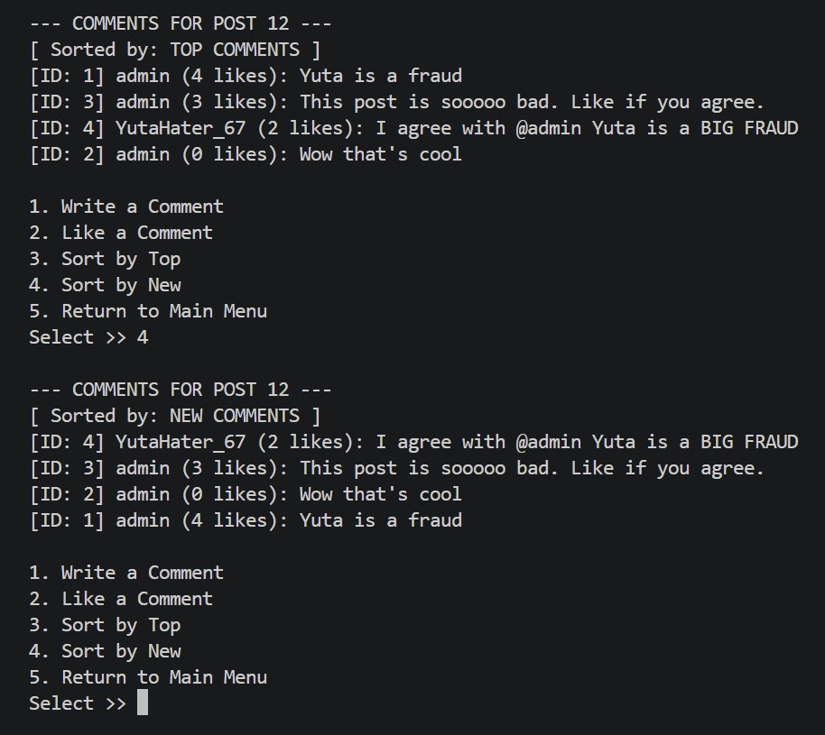

ConnectU is a text-based social network developed as the core project for the Data Structures and Algorithms lab (ECE 367L) at UH Manoa. The project began with a basic starter template that allowed users to log in from a premade list, displaying a dashboard of seven initially unimplemented features. Over the course of six labs, the application was systematically built out to function as a complete social platform by integrating a variety of data structures and algorithms learned over the semester. This included using linked lists for user timelines, hash tables for authentication, heaps for an algorithmic feed, and breadth-first search (BFS) for traversing the social graph to recommend friends.  

For the final phase of the project, My team was to design and integrate a dynamic commenting system. To manage the comments on each post efficiently, I utilized a Binary Search Tree (BST) keyed by a unique comment ID, which enabled recursive lookups when users liked a specific comment. Furthermore, I implemented custom sorting features that allowed users to view comment sections organized either by "Top Comments" or "New Comments". This was achieved by traversing the BST and loading the comments into a Priority Queue configured with comparators. The priority queue then dynamically ordered the comments based on like counts or timestamps, successfully demonstrating the practical application of combining multiple data structures to build this complex feature.  

claude.ai was used to organize thoughs and check for grammar.

