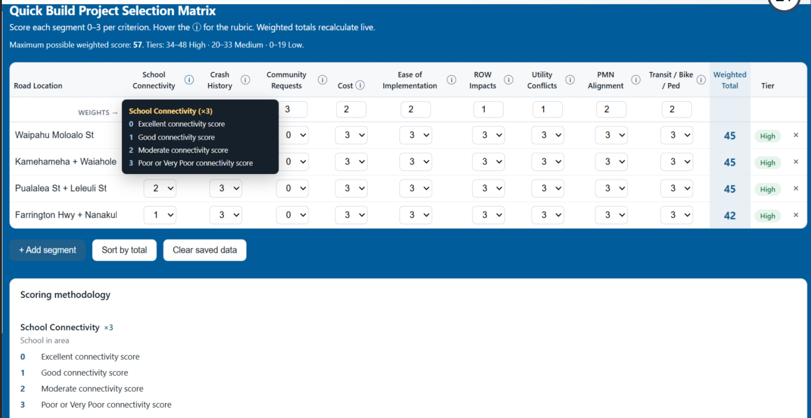

The Quick Build Project Selection Matrix is currently a web-based tool I built from scratch in HTML and JavaScript to help prioritize candidate street-safety projects for the Hawaii Department of Transportation. Quick-build projects improve street safety using low-cost, easy-to-install materials, ideally costing $50,000 or less and takes less than a year to install. The challenge is deciding which locations to fund first when there are far more candidate sites than available resources, which can be easily organized using this tool.

Each candidate project is scored against a set of weighted criteria that reflect what matters most to the program: crash history and community requests carry the heaviest weight (×3), followed by cost, ease of implementation, active-transportation network alignment, transit/bike/pedestrian benefit, and proximity to schools (×2), with right-of-way impacts and utility conflicts weighted lower (×1). The tool computes a composite score for each site and sorts the listed projects into priority tiers, making it easy to see instantly which locations should be prioritized most and why.

